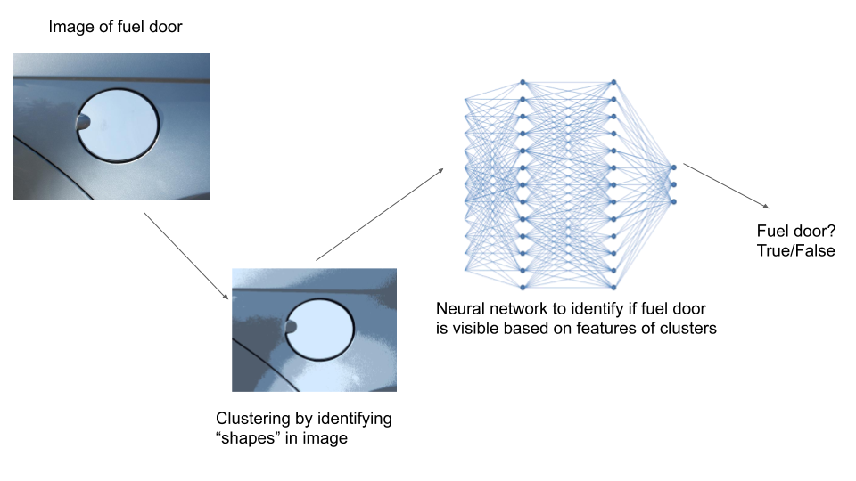

# CS4641_ML_Project

Group Members: David Saiontz, Spencer Shook, Aman Singh

# Summary Figure

# Introduction

## Data Set
Spencer

## Unsupervised Learning

With our images, we performed K-Means clustering on the images by performing the following steps:

<ol>
<li>Take a given image from the dataset.</li>
<li>Flatten the image by reshaping an (I, J, K) 3D array into an (IxJ, K) array.</li>
<li>Run the KMeans algorithm on the flattened image from k=3 clusters to k=10 clusters, saving the clustered images and the inertia of each clustered image.</li>
<ul>
<li>The inertia represents the sum of squared distances of pixels to their closest cluster center. This allows us to programatically perform the elbow method to determine the ideal number of clusters to save.</li>
</ul>
<li>Once K-Means has been run from k=3 to k=10, we programatically determine the elbow of the graph of inertias, using this to determine the number of clusters that worked best for the given image, and thus, which clustered image we should save.</li>
<li>We save the chosen clustered image as well as the graph that represents the number of clusters vs the inertia of each cluster, along with where we deterined the elbow, so that we can sample a subset of the images and verify that the elbow was determined correctly.</li>
</ol>

Through this process, we can identify the ideal number of clusters that minimizes extra noise while maximizing the clarity of the fuel door.

## Supervised Learning
Spencer

# Results
Aman

# Discussion

During testing with the clustered images, we noticed that our clustering algorithm would, at times, lose some of the clarity of the fuel caps. As a result, we believe that this caused some issues with our neural network, as it would make the images harder to successfully classify.

Meanwhile, when testing with the unclustered images, because our dataset was only ~400 images, and the images had significantly more detail visible, we believe that our neural network was overfitting to our data.

To remedy each of these issues, we believe that we would need to know the specific angle the vehicle would be, so as to minimize any extra noise in the images, and then use clustering to further reduce the noise, and finally run the neural network on the image to determine if the image contains a fuel cap. This would not only increase the success rate of the neural network, but would also require significantly fewer images to train the neural network, since it would be trained to work with a camera that is at a particular angle, rather than a camera that could be at any angle.

That being said, with unclusterd images, we were still reaching a 75% successful identification rate on average, which is a good baseline to continue work on the dataset and neural network.

Next steps for the project would include either gathering significantly more images and manually classifying them, as there are no datasets of vehicles with labels for if the fuel cap is visible or not. In addition, more testing with the number of layers and type of activation function for the neural network would be necessary with a larger dataset. Finally, the neural network would need to be saved and deployed, along with a dynamic clustering algorithm for a live camera feed would be necessary to utilize our project at an autonomous gas station.

# References
Spencer

