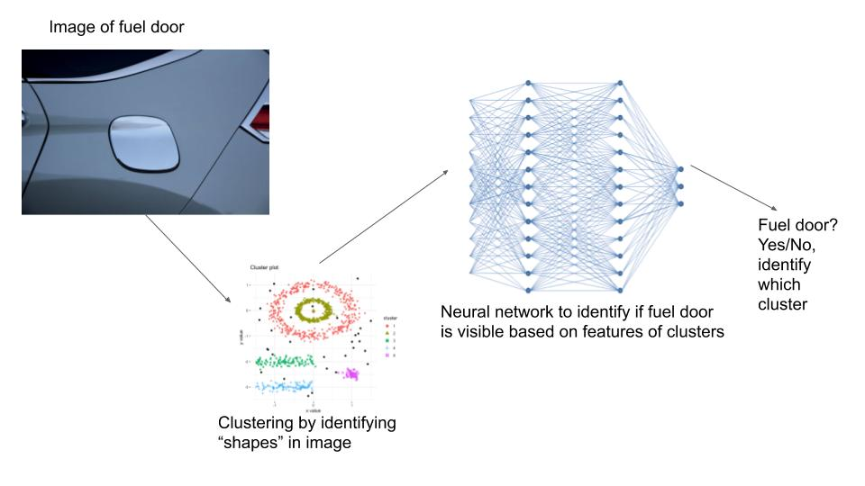

# CS4641_ML_Project

Group Members: David Saiontz, Spencer Shook, Aman Singh, Liam Gedney

# Summary Figure

# Introduction

# Final Methodology and Data Set

Our dataset is comprised currently of 100 images of cars with the fuel dor visible. We created this dataset through scraping the internet.

With these images, we performed K-Means clustering on the images by performing the following steps:

<ol>
<li>Take a given image from the dataset.</li>
<li>Flatten the image by reshaping an (I, J, K) 3D array into an (IxJ, K) array.</li>
<li>Run the KMeans algorithm on the flattened image from k=3 clusters to k=10 clusters, saving the clustered images and the inertia of each clustered image.</li>
<ul>
<li>The inertia represents the sum of squared distances of pixels to their closest cluster center. This allows us to programatically perform the elbow method to determine the ideal number of clusters to save.</li>
</ul>
<li>Once K-Means has been run from k=3 to k=10, we programatically determine the elbow of the graph of inertias, using this to determine the number of clusters that worked best for the given image, and thus, which clustered image we should save.</li>
<li>We save the chosen clustered image as well as the graph that represents the number of clusters vs the inertia of each cluster, along with where we deterined the elbow, so that we can sample a subset of the images and verify that the elbow was determined correctly.</li>
</ol>

Through this process, we correctly identify the ideal number of clusters that minimizes extra noise while maximizing the clarity of the fuel door.

# Results 

# Next Steps

# Distribution of Work

David Saiontz: Find and add 25 images to dataset, wrote the K-Means clustering method and added programatic determination of elbow in elbow method. Also helped in creating the single powerpoint slide for touchpoint 2.