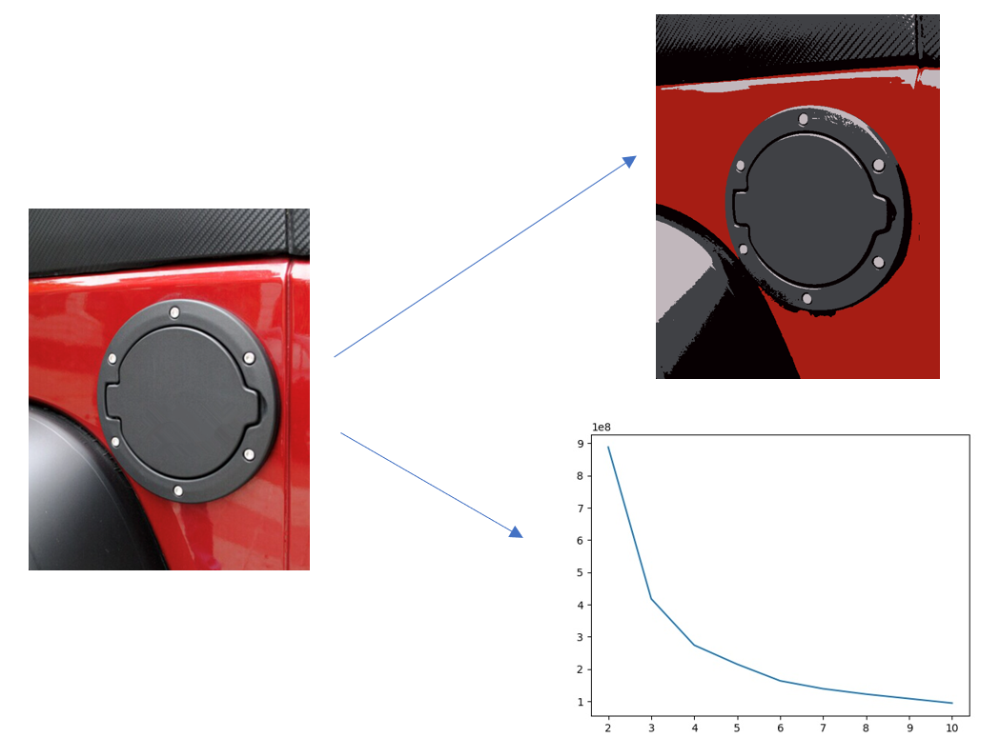
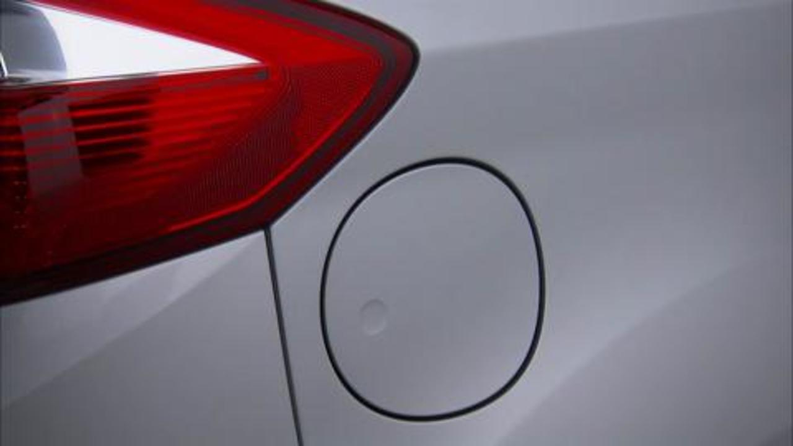

# CS4641_ML_Project

Group Members: David Saiontz, Spencer Shook, Aman Singh, Liam Gedney

# Summary Figure

# Introduction

# Methodology and Data Set

Our dataset is comprised currently of 100 images of cars with the fuel dor visible. We created this dataset through scraping the internet.

With these images, we performed K-Means clustering on the images by performing the following steps:

<ol>
<li>Take a given image from the dataset.</li>
<li>Flatten the image by reshaping an (I, J, K) 3D array into an (IxJ, K) array.</li>
<li>Run the KMeans algorithm on the flattened image from k=3 clusters to k=10 clusters, saving the clustered images and the inertia of each clustered image.</li>
<ul>
<li>The inertia represents the sum of squared distances of pixels to their closest cluster center. This allows us to programatically perform the elbow method to determine the ideal number of clusters to save.</li>
</ul>
<li>Once K-Means has been run from k=3 to k=10, we programatically determine the elbow of the graph of inertias, using this to determine the number of clusters that worked best for the given image, and thus, which clustered image we should save.</li>
<li>We save the chosen clustered image as well as the graph that represents the number of clusters vs the inertia of each cluster, along with where we deterined the elbow, so that we can sample a subset of the images and verify that the elbow was determined correctly.</li>
</ol>

Through this process, we correctly identify the ideal number of clusters that minimizes extra noise while maximizing the clarity of the fuel door.

# Results 
Through the process above, we used K-means clustering to cluster 100 images, each one containing a car's fuel port.  We found that over 90% of these images were optimally clustered using either three or four clusters and 100% of the images were optimally clustered using three to five clusters.  We were initially surprised that all of the images were optimally clustered using three to five clusters, but upon review, we noticed that most of our images are close-up images of cars with only a few prevalent colors, so it makes sense that only a few clusters are needed.  In a majority of the images, there is a noticeable effect from environmental lighting which we were worried would throw off our classification.  When we compare the images before and after clustering, the effects of environmental seems to be reduced in nearly all of the imgages, but especially those images which were optimally clustered with three clusters.  We believe that we will be more accurate in classifying these images now that the clustering process has reduced the effects of environmental lighting and other noise within the images.  

 

 

# Next Steps

<<<<<<< Updated upstream
Our next step is to pipe 100 more images into the dataset. We will have two datasets, one with car doors visible and one without. We will then use those datasets to train a neural network. From there, all that's left is to test it with variety options and document everything.
=======
The next step is to pipe 100 more images into the dataset. We will have two datasets, one with fuel doors visible and one without. We will then use those datasets to train a neural network. From there, all that's left is testing and documentation of everything.
>>>>>>> Stashed changes

# Distribution of Work

David Saiontz: Find and add 25 images to dataset, wrote the K-Means clustering method and added programatic determination of elbow in elbow method. Also helped in creating the single powerpoint slide for touchpoint 2.

Spencer Shook: Found 25 images for the dataset, came up with initial project idea and helped to define project goals and methods, assisted in creating powerpoint fortouchpoint 2, presented progress for touchpoint 2.  

<<<<<<< Updated upstream
Liam Gedney: Found 25 images for the dataset, wrote results section of readme, wrote next steps section of midterm report.
=======
Liam Gedney: Found 25 images for the dataset, Wrote results section of readme, wrote next steps section of Midterm report.
>>>>>>> Stashed changes
