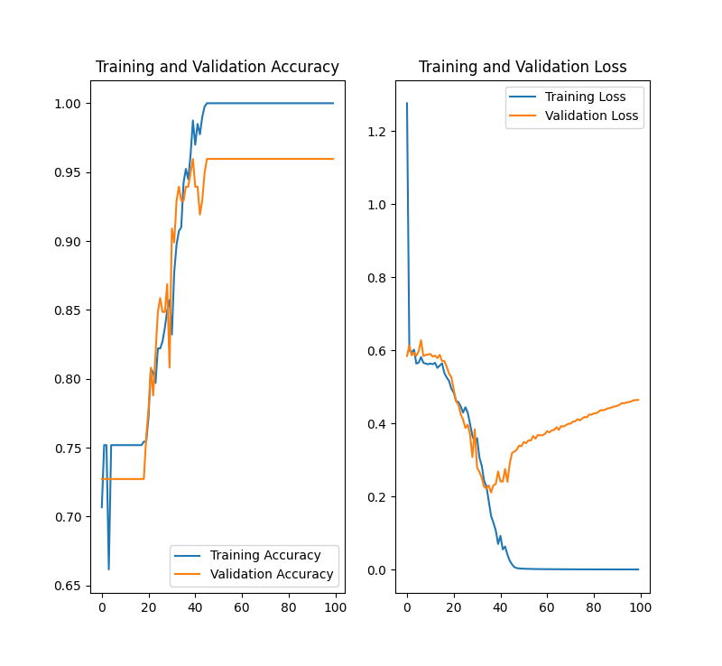

# CS4641_ML_Project

Group Members: David Saiontz, Spencer Shook, Aman Singh

# Summary Figure

# Introduction
Throughout the course of this semester, we have attempting to dynamically identify fuel caps on vehicles. To approach this, we used unsupervised learning in the form of K-means clustering and supervised learning in the form of neural networks. When attempting supervised learning, we ran into two main problems: adjusting the parameters to balance the line between accurately identifying the fuel cap and not overfitting the model. We also realized that our initial dataset was not as up to par as it should have been. We tried to add more images of fuel caps, and cars without the fuel caps, but eventually we pulled an existing dataset and manually classified those. Our goal was to create an algorithm which could successfully identify if a car's fuel cap was within an image to use as part of an autonomous refueling system which could refuel a car without needing any human intervention.  

## Data Set
Initially our dataset consisted of 200 images of cars where half of the images contained the car's fuel door and the other half did not contain the car's fuel door.  These images were pulled from Google Images by team members. We aimed to have a wide variety of car images which could be representative of all possible pictures of cars.  The images were from a variety of angles, of different sides of the cars, and from different distances from the cars.  

After our initial testing, we determined that we needed more images to train our model, so we manually classified an additional 300 images from one of Stanford's available datasets (https://ai.stanford.edu/~jkrause/cars/car_dataset.html).  With the inclusion of these images, our dataset now includes 500 images.  Each of these images was clustered using K-means as described below thus making our overall dataset 500 clustered and 500 unclustered images.  

## Unsupervised Learning

With our images, we performed K-Means clustering on the images by performing the following steps:

<ol>
<li>Take a given image from the dataset.</li>
<li>Flatten the image by reshaping an (I, J, K) 3D array into an (IxJ, K) array.</li>
<li>Run the KMeans algorithm on the flattened image from k=3 clusters to k=10 clusters, saving the clustered images and the inertia of each clustered image.</li>
<ul>
<li>The inertia represents the sum of squared distances of pixels to their closest cluster center. This allows us to programatically perform the elbow method to determine the ideal number of clusters to save.</li>
</ul>
<li>Once K-Means has been run from k=3 to k=10, we programatically determine the elbow of the graph of inertias, using this to determine the number of clusters that worked best for the given image, and thus, which clustered image we should save.</li>
<li>We save the chosen clustered image as well as the graph that represents the number of clusters vs the inertia of each cluster, along with where we deterined the elbow, so that we can sample a subset of the images and verify that the elbow was determined correctly.</li>
</ol>

Through this process, we can identify the ideal number of clusters that minimizes extra noise while maximizing the clarity of the fuel door.

## Supervised Learning
We constructed a neural network using Tensorflow. We constructed a neural network to classify the images in our dataset on whether a fuel door is present in the image.  To do this, we leveraged Tensorflow to construct our model and also to handle splitting our data into training and validation sets.   

Tested using both clustered and unclustered images. We ran our model on both the clustered and unclustered images of our dataset and compared the outcome.  We graphed the accuracy and (loss?) over the epochs.  We tested our model with various numbers of epochs between 10 and 1000, but we usually used 100 epochs.  We tried varying the number of layers in our model between 1 and 10 to find a balance between accuracy and model overfitting.  Lastly, we tried using different activation functions to improve the model's accuracy.  We used 3 layers in most of our testing where the first layer used a sigmoid activation function and the other 2 layers used ReLU.  

Our neural network reached its highest accuracy levels when it was run with more than 100 epochs and 3 layers of 16, 32, and 64 nodes and using sigmoid, ReLU and ReLU activation functions respectively.  

# Results
In running the K-means clustering algorithm on our dataset, we found that every one of our images was optimally clustered using three to five clusters with the vast majority (92%) of images being optimally clustered with only three clusters.

In training our neural network on our unclustered dataset, we reached 95% training and validation accuracy when using the settings as described above and training for more than 100 epochs.  When we trained our NN using only sigmoid or only ReLU activation functions, we were only able to reach 75% to 90% accuracy with non-converging loss.  At times, the accuracy did not trend upward but rather varied wildly within 50% to 75%. 

With our clustered dataset, we were only able to reach a maximum accuracy of 75% with the optimal settings described above. When we varied the number of layers, number of nodes, and activation functions, the validation accuracy fluctuated between 55% and 70%.   

# Discussion

During testing with the clustered images, we noticed that our clustering algorithm would, at times, lose some of the clarity of the fuel doors. As a result, we believe that this caused some issues with our neural network, as it would make the images harder to successfully classify.

When initially testing with our unclustered dataset, because our initial dataset was only 200 images, and the images had significantly more detail visible, we believe that  neural network was overfitting to our data.  This was confirmed by the obvious divergence in training and validation loss which tends to occur after 40 epochs.  

Overall, we were pleased with reaching 95% validation accuracy with our neural network on unclustered images.  When we saw our initial results were around 60% accuracy, we were going to have to try a different approach.  We would like to find ways to push our accuracy higher without increasing our current overfitting.  We believe the best way to do this would be to vastly enlarge our dataset to several thousand images and to continue to tune our neural network's settings.   

Next steps for the project would include either gathering significantly more images and manually classifying them, as we were not able to find any datasets with labels for if a car's fuel door is visible or not. In addition, we would like to perform more testing with the number of layers and type of activation function to see if we can reduce overfitting. Finally, the neural network would need to be saved and deployed, potentially with a dynamic clustering algorithm for a live camera feed to utilize our project at an autonomous gas station.

# References
https://ai.stanford.edu/~jkrause/cars/car_dataset.html - Stanford car image dataset
https://www.tensorflow.org/tutorials/images/classification - Tutorial on TensorFlow
https://towardsdatascience.com/cluster-based-image-segmentation-python-80a295f4f3a2

